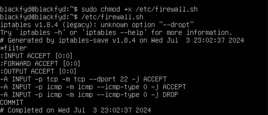
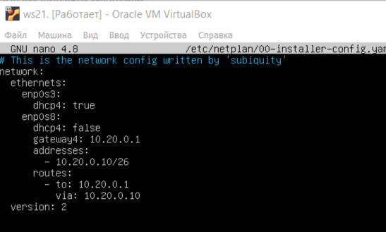
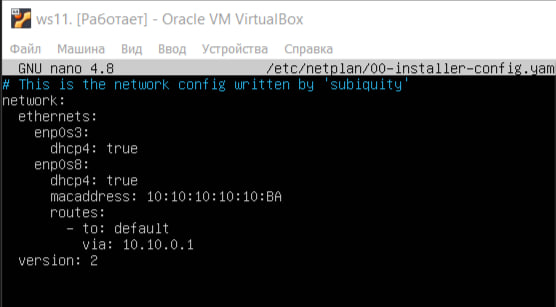
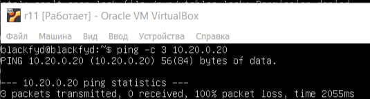
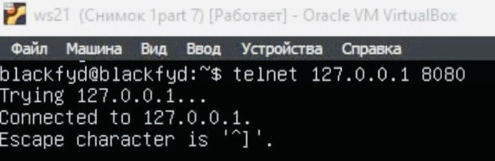

# Part 1.Инструмент ipcalc
== Задача ==

Запускаем виртуальную машину (далее -- ws1)

## 1.1. Сети и маски

Определите и запишите в отчете:
1) сетевой адрес 192.167.38.54/13

С помощью команды sudo apt install ipcalc усталновила ipcalc

Сетевой адрес 192.160.0.0/13

2) 
- преобразование маски 255.255.255.0 в префиксную и двоичную, 

.png)
Маска в префиксной и двоичной записи

/24
11111111.11111111.11111111.00000000

- /15 в обычную и двоичную, 

 Преобразовала с помощью команды: ipcalc /15
 (1).png)

 255.254.0.0
 11111111.11111110.00000000.00000000

- 11111111.11111111.11111111.11110000 в обычную и префиксную

255.255.255.240
/28
(2).png)
11111111.11111111.11111111.1111 0000 в обычной и префиксной

3) минимальный и максимальный хост в сети 12.167.38.4 с масками: /8 , 11111111.11111111.00000000.00000000 , 255.255.254.0 и /4

Проверила на максимальное и минимальное с помощью команды: ipcalc 12.167.38.4/(mask)

- /8
.png)

- /11111111.11111111.00000000.00000000
(1).png)

- /255.255.254.0 
(2).png)

- /4
(3).png)

## 1.2. Локальный хост
Определите и напишите в отчете, можно ли получить доступ к приложению, работающему на локальном хосте, со следующих IP-адресов: 

- 127.0.0.2 , 127.1.0.1 ,
.png)
Могу обратиться к IP адресам 127.0.0.2, 127.1.0.1, так как присутствует Loopback

- 194.34.23.100, 128.0.0.1.
(1).png)
Нельзя обратиться к IP адресам 194.34.23.100, 128.0.0.1, так как у них нет петли

## 1.3. Диапазоны и сегменты сети
Определите и запишите в отчете:
1) какие из перечисленных IP можно использовать как публичные, а какие только как частные: 10.0.0.45 , 134.43.0.2 , 192.168.4.2 , 172.20.250.4 , 172.0.2.1 , 192.172.0.1 , 172.68.0.2 , 172.16.255.255 , 10.10.10.10 , 192.169.168.1
- 10.0.0.45 
.png)
Частный

- 134.43.0.2
(1).png)
Публичный

- 192.168.4.2
(2).png)
Частный

- 172.20.250.4
(3).png)
Частный

- 172.0.2.1
(4).png)
Публичный

- 192.172.0.1 
(5).png)
Публичный

- 172.68.0.2 
(6).png)
Публичный

- 172.16.255.255 
(7).png)
Частный

- 10.10.10.10 
(8).png)
Частный

- 192.169.168.1
(9).png)
Публичный

2) какие из перечисленных IP-адресов шлюза возможны для сети 10.10.0.0/18 : 10.0.0.1 , 10.10.0.2 , 10.10.10.10 , 10.10.100.1 , 10.10.1.255

Диапозон шлюза
(10).png)

- 10.0.0.1 (нет)
- 10.10.0.2 (да)
- 10.10.10.10 (да)
- 10.10.100.1 (нет)
- 10.10.1.255 (да)

# Part 2.Статическая маршрутизация между двумя машинами
== Задача ==

Запустите две виртуальные машины (далее — ws1 и ws2)

Просмотрите существующие сетевые интерфейсы с помощью команды: ip a
.png)
.png)

- Опишите сетевой интерфейс, соответствующий внутренней сети на обеих машинах и задайте следующие адреса и маски: ws1 - 192.168.100.10, mask */16 *, ws2 - 172.24.116.8, mask /12.Добавьте в отчет скриншоты измененного файла etc/netplan/00-installer-config.yaml для каждой машины.
.png)
.png)
Изменения в конфиге с помощью команды: sudo nano /etc/netplan/00-installer-config.yaml

- Выполни команду netplan apply для перезапуска сервиса сети. В отчёт помести скрин с вызовом и выводом использованной команды
.png)
.png)
Вывод команды: ip a (для двух машин)

## 2.1. Добавление статического маршрута вручную
- Добавь статический маршрут от одной машины до другой и обратно при помощи команды вида ip r add.
Добывила статический маршрут от одной машины до другой и обратно с помощью команд:
1) sudo ip r add 172.24.116.8 via 192.168.100.10 dev enp0s8
2) sudo ip r add 192.168.100.10 via 172.24.116.8 dev enp0s8

- Пропингуй соединение между машинами. В отчёт помести скрин с вызовом и выводом использованных команд
.png)
(1).png)

## 2.2. Добавление статического маршрута с сохранением
- Перезапусти машины
Перезапустила машины с помощью команды: sudo reboot

- Добавь статический маршрут от одной машины до другой с помощью файла /etc/netplan/00-installer-config.yaml.В отчёт помести скрин с содержанием изменённого файла /etc/netplan/00-installer-config.yaml

Добавляю статический маршрут от одной машины до другой с помощью команды: sudo nano /etc/netplan/00-installer-config.yaml
.png)
(2).png)

- Пропингуй соединение между машинами.В отчёт помести скрин с вызовом и выводом использованной команды
(3).png)
(4).png)

# Part 3. Утилита iperf3
## 3.1. Скорость соединения
- Переведи и запиши в отчёт: 8 Mbps в MB/s, 100 MB/s в Kbps, 1 Gbps в Mbps
8 Mbps = 1 MB/s
100 MB/s = 800000 Kbps
1 Gbps = 1000 Mbps

## 3.2. Утилита iperf3
- Измерь скорость соединения между ws1 и ws2.В отчёт помести скрины с вызовом и выводом использованных команд
Установила iperf3 с помощью команды: sudo apt install iperf3 

Вывод команды iperf3

# Part 4. Сетевой экран
## 4.1. Утилита iptables
- Создай файл /etc/firewall.sh, имитирующий фаерволл, на ws1 и ws2:
sudo touch /etc/firewall.sh

Нужно добавить в файл подряд следующие правила:

1) На ws1 примени стратегию, когда в начале пишется запрещающее правило, а в конце пишется разрешающее правило (это касается пунктов 4 и 5).

2) На ws2 примени стратегию, когда в начале пишется разрешающее правило, а в конце пишется запрещающее правило (это касается пунктов 4 и 5).

3) Открой на машинах доступ для порта 22 (ssh) и порта 80 (http).

4) Запрети echo reply (машина не должна «пинговаться», т.е. должна быть блокировка на OUTPUT).

5) Разреши echo reply (машина должна «пинговаться»).

- В отчёт помести скрины с содержанием файла /etc/firewall для каждой машины

На ws1

На ws2

Содержание файлов firewall на двух машинах

- Запусти файлы на обеих машинах командами chmod +x /etc/firewall.sh и /etc/firewall.sh.
В отчёт помести скрины с запуском обоих файлов

На ws1

На ws2

- В отчёте опиши разницу между стратегиями, применёнными в первом и втором файлах
Разница заключается в том, что на первой машине прием пакетов открыт из-за того,что мы ввели разрешающее правило в конце, а на второй машине прием пакетов закрыт, пока мы не откроем его снова.

#### 4.2. Утилита nmap
- Командой ping найди машину, которая не «пингуется»

ws1

ws2

ws2 не пингуется

- Используйте утилиту nmap, чтобы показать, что хост машины работает

Установила nmap с помощью команды: sudo apt install nmap

# Part 5. Статическая маршрутизация сети

- Подними пять виртуальных машин (3 рабочие станции (ws11, ws21, ws22) и 2 роутера (r1, r2)).

Подняла 5 виртуальных машин

#### 5.1. Настройка адресов машин
- Настрой конфигурации машин в etc/netplan/00-installer-config.yaml согласно сети на рисунке
- В отчёт помести скрины с содержанием файла etc/netplan/00-installer-config.yaml для каждой машины

Config ws11

Config ws21.

Config ws22.

Config r11

Config r22

- Перезапусти сервис сети. Если ошибок нет, то командой 'ip -4 a' проверь, что адрес машины задан верно. В отчёт помести скрины с вызовом и выводом использованных команд.

- Также пропингуй ws21 с ws22.

Пропинговала машины ws21 с ws22

- Аналогично пропингуй ws11 с r1.

Пропинговала машины ws11 с r1

#### 5.2. Включение переадресации IP-адресов
- Для включения переадресации IP, выполни команду на роутерах:
sysctl -w net.ipv4.ip_forward=1  При таком подходе переадресация не будет работать после перезагрузки системы
В отчёт помести скрин с вызовом и выводом использованной команды

Команда sysctl -w net.ipv4.ip_forward=1 на r11

Команда sysctl -w net.ipv4.ip_forward=1 на r22

- Открой файл /etc/sysctl.conf и добавь в него следующую строку:
net.ipv4.ip_forward = 1  При использовании этого подхода, IP-переадресация включена на постоянной основе.В отчёт помести скрин с содержанием изменённого файла /etc/sysctl.conf.

Добавила на r11

Добавила на r22

## 5.3. Установка маршрута по-умолчанию
- Настрой маршрут по-умолчанию (шлюз) для рабочих станций. Для этого добавь default перед IP роутера в файле конфигураций.В отчёт помести скрин с содержанием файла etc/netplan/00-installer-config.yaml

Config ws11

Config ws21.

Config ws22.

Config r11

Config r22

- Вызови ip r и покажи, что добавился маршрут в таблицу маршрутизации
В отчёт помести скрин с вызовом и выводом использованной команды.

На ws11

На ws21.

На ws22.

На r11

На r22

- Пропингуй с ws11 роутер r2 и покажи на r2, что пинг доходит. Для этого используй команду:tcpdump -tn -i eth0. В отчёт помести скрин с вызовом и выводом использованных команд

Пропинговала с ws11. роутер r22

Вывод команды: tcpdump -tn -i eth0

## 5.4. Добавление статических маршрутов
- Добавь в роутеры r1 и r2 статические маршруты в файле конфигураций. Пример для r1 маршрута в сетку 10.20.0.0/26:. В отчёт помести скрины с содержанием изменённого файла etc/netplan/00-installer-config.yaml для каждого роутера

Маршруты r11

Маршруты r22

- Вызови ip r и покажи таблицы с маршрутами на обоих роутерах.
В отчёт помести скрин с вызовом и выводом использованной команды

Команда на r11

Команда на r22

- Запусти команды на ws11: ip r list 10.10.0.0/[маска сети] и ip r list 0.0.0.0/0. В отчёт помести скрин с вызовом и выводом использованных команд

- В отчёте объясни, почему для адреса 10.10.0.0/[маска сети] был выбран маршрут, отличный от 0.0.0.0/0, хотя он попадает под маршрут по-умолчанию. 

Для этого адресного диапазона есть более приоритетный маршрут (статический) чем default, а у 0.0.0.0/0 будет общий маршрут, указанный под default

## 5.5. Построение списка маршрутизаторов
Запусти на r1 команду дампа: tcpdump -tnv -i eth0

- При помощи утилиты traceroute построй список маршрутизаторов на пути от ws11 до ws21

# 5.6. Использование протокола ICMP в маршрутизации
- Запуск захвата сетевого трафика r1, проходящего через eth0 с параметром
'tcpdump -n -i eth0 icmp' команда.

запустила с помощью команды:sudo tcpdump -n -i enp0s3

- Проверьте связь с несуществующим IP-адресом (например, 10.30.0.111) с помощью команды ws11
'ping -c 1 10.30.0.111' команда.

# Часть 6. Динамическая настройка IP-адресов с помощью DHCP
== Задача ==

- Для r2 настройте службу DHCP в файле /etc/dhcp/dhcpd.conf:
1) Укажите адрес роутера по умолчанию, DNS-сервер и адрес внутренней сети. 

2) Запишите в файл resolv.conf nameserver 8.8.8.8
- Добавьте в отчет скриншоты измененных файлов.

- Перезапустите службу DHCP с помощью 'systemctl restart isc-dhcp-server' . Перезагрузите машину ws21 и покажите, что у нее есть адрес. Также пингуем ws22 из ws21.systemctl restart isc-dhcp-serverrebootip a
Добавьте в отчет скриншот со звонком и выводом использованных команд.

Перезагрузила r22. Посмотрела адрес с помощью команды: ip a

ping c ws21 ws22

- Укажите MAC-адрес в ws11, добавив в etc/netplan/00-installer-config.yaml:
macaddress: 10:10:10:10:10:BA, dhcp4: true

- Настройте r1 так же, как и r2, но сделайте назначение адресов строго привязанным к MAC-адресу (ws11). Выполнение одних и тех же тестов
Опишите эту часть в отчете так же, как и для r2.

Настроила службу DHCP в файле /etc/dhcp/dhcpd.conf

Посмотрела адрес с помощью команды: ip a

- Запрос обновления IP-адреса из ws21. Добавить в отчет скриншоты ip до и после обновления;

Опишите в отчете, какие параметры DHCP-сервера использовались в этом пункте.
При настройке DHCP сервера использовались опции:
1. subnet: Определяет подсеть и её параметры, такие как диапазон IP-адресов, маску подсети, шлюз по умолчанию и другие параметры.

2. range: Устанавливает диапазон IP-адресов, который DHCP сервер будет использовать для назначения клиентам.

3. option routers: Задает IP-адрес шлюза по умолчанию, который DHCP сервер будет предоставлять клиентам, чтобы они могли попасть в другие сети или в Интернет.

4. option domain-name-servers: Определяет DNS-серверы, которые DHCP сервер будет предоставлять клиентам, чтобы они могли выполнять разрешение имен на IP-адреса.

5. host: Позволяет назначить опции для конкретного хоста по его MAC-адресу, что позволяет настраивать индивидуальные параметры для определенных устройств в сети.

# Часть 7. НАТ
== Задача ==

- В файле /etc/apache2/ports.conf измените строку на ws22 и r1, т.е. сделайте сервер Apache2 публичнымListen 80Listen 0.0.0.0:80
Добавьте в отчет скриншот измененного файла

измененный ports.conf

- Запустите веб-сервер Apache с помощью команды на ws22 и r1 service apache2 start
Добавьте в отчет скриншоты со звонком и выводом используемой команды.

- Добавьте следующие правила в брандмауэр, созданный аналогично брандмауэру из части 4, на r2:
1) удалить правила в таблице фильтров - iptables -F
2) удалить правила в таблице "NAT" - iptables -F -t nat
3) отбрасывать все маршрутизируемые пакеты - iptables --policy FORWARD DROP

- Запустите файл, как описано в части 4

- Проверьте соединение между ws22 и r1 с помощью команды ping. При запуске файла с этими правилами ws22 не должен пинговать с r1

ws22. не пингуется с r11

- Добавьте в файл еще одно правило:
4) разрешить маршрутизацию всех пакетов протокола ICMP

Новое правило

- Запустите файл, как описано в части 4.Проверьте соединение между ws22 и r1 с помощью команды ping
При запуске файла с этими правилами ws22 должен выполнить ping от r1

- Добавь в файл ещё два правила:
5) Включи **SNAT**, а именно маскирование всех локальных ip из локальной сети, находящейся за r2 (по обозначениям из Части 5 - сеть 10.20.0.0).
6) Включи **DNAT** на 8080 порт машины r2 и добавить к веб-серверу Apache, запущенному на ws22, доступ извне сети.

Измененный firewall 

Запусти файл также, как в Части 4.
chmod +x /etc/firewall.sh и /etc/firewall.sh

- Проверь соединение по TCP для **SNAT**: для этого с ws22 подключиться к серверу Apache на r1 командой:
`telnet [адрес] [порт]`

Команда:telnet 10.20.0.20 80

- Проверь соединение по TCP для **DNAT**: для этого с r1 подключиться к серверу Apache на ws22 командой `telnet` (обращаться по адресу r2 и порту 8080).
- В отчёт помести скрины с вызовом и выводом использованных команд.

Команда: telnet 10.100.0.12 8080

# Part 8. Дополнительно. Знакомство с **SSH Tunnels**

- Запусти на r2 фаервол с правилами из Части 7.

Запустила фаервол на r22.

- Запусти веб-сервер **Apache** на ws22 только на localhost (то есть в файле */etc/apache2/ports.conf* измени строку `Listen 80` на `Listen localhost:80`).

Запустила apache2 на ws22. с исправленным Listen

- Воспользуйся *Local TCP forwarding* с ws21 до ws22, чтобы получить доступ к веб-серверу на ws22 с ws21.

`ssh -L 8080:localhost:80 blackfyd@10.20.0.10`

- Воспользуйся *Remote TCP forwarding* c ws11 до ws22, чтобы получить доступ к веб-серверу на ws22 с ws11.

`ssh -R 8080:localhost:80 blackfyd@10.20.0.10`

- Для проверки, сработало ли подключение в обоих предыдущих пунктах, перейди во второй терминал (например, клавишами Alt + F2) и выполни команду:
`telnet 127.0.0.1 [локальный порт]`

`telnet 127.0.0.1 8080` на ws21

`telnet 127.0.0.1 80` на ws11

